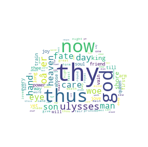

# Python Natural Language Processing 

This is a collection of tools for analysing language.

My initial learning has come from the Codecademy course on [Natural Language Processing](https://www.codecademy.com/learn/natural-language-processing)

---

## Setup and Packages 
The programs use:
* Python 3
* pip3 for installing packages
* nltk
* re
* collections

---

  
   

---

## Source texts
The programs analyse texts taken from [Project Gutenbeg](http://www.gutenberg.org/wiki/Main_Page):
* [The Iliad](http://www.gutenberg.org/ebooks/6130)
* [The Odyssey](http://www.gutenberg.org/files/3160/3160-0.txt)

---

## __parse.py__ 
This program takes a text and identifies the grammatical type of each word. 

---

## __word_count.py__ 
This program takes a text and for each word counts the number of times that word occurs. 

---

## __top_ten_ngrams.py__ 
This program takes a text and displays the top ten two-word, three-word and five-word phrases by frequency.

---

## __text_generator.py__ 
This program takes two training texts to learn from then. These should be from the same author (in this case, Homer, so it's debatable if they are the same author!). The program analyses the text and generates a short text in the style of the author of the training texts.

---

## __word_cloud.py__ 
This program takes a text and displays the most frequeny words in a word cloud. I've followed the lesson from [Tutorialspoint](https://www.tutorialspoint.com/create-word-cloud-using-python), with a few adaptations, such as generating unique filenames based on the title of the text.

---

## Problems and Workarounds
There were problems trying to use nltk. I had to open the Python shell (in terminal, type `python` then hit `enter`), then had to download various models. See [stack overflow advice, answer 11](https://stackoverflow.com/questions/38916452/nltk-download-ssl-certificate-verify-failed/59530679#59530679)